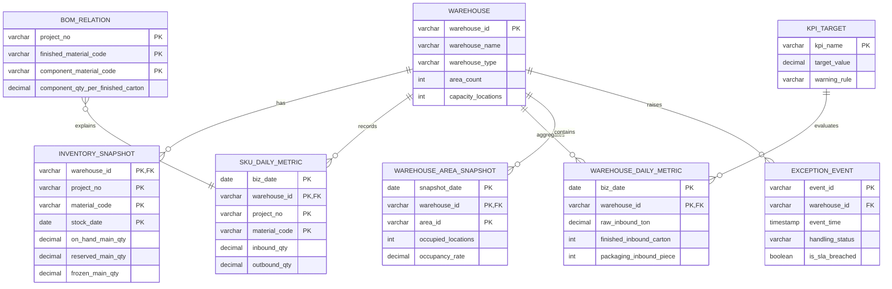

# 仓库运营看板数据库设计

## 1. 设计目标

数据库以 `仓库运营信息看板_模拟数据集_2026年7月.xlsx` 中的原子数据为事实来源，支持原料库、成品库、箱盒库三个看板共用同一套数据口径。

- 主数据、原子事实和可计算汇总分开保存。
- 完整工作簿导入在单个事务内校验并替换，失败时不污染现有数据。
- CSV 只合并仓库日指标，主键为 `业务日期 + 仓库编码`。
- 看板摘要、全仓每日指标和异常分布在查询时计算，不重复持久化。
- 所有业务表均使用 `utf8mb4` 数据库，日期和数值保持原生类型。

## 2. 关系模型

## 3. Excel 与 MySQL 映射

| Excel 工作表 | MySQL 表 | 粒度 | 导入策略 |
|---|---|---|---|
| 仓库主数据 | `warehouse` | 仓库 | 完整替换 |
| 现存量快照 | `inventory_snapshot` | 仓库 + 项目 + 物料 + 日期 | 完整替换 |
| 运营_SKU日指标 | `sku_daily_metric` | 日期 + 仓库 + 项目 + 物料 | 完整替换 |
| 运营_仓库每日指标 | `warehouse_daily_metric` | 日期 + 仓库 | 完整替换或 CSV 合并 |
| 运营_库区状态 | `warehouse_area_snapshot` | 日期 + 仓库 + 库区 | 完整替换 |
| 运营_异常事件 | `exception_event` | 异常编号 | 完整替换 |
| 项目_BOM关系 | `bom_relation` | 项目 + 成品 + 组件 | 完整替换 |
| 运营_KPI目标 | `kpi_target` | KPI 名称 | 完整替换 |
| 仓库切换看板、运营_每日指标、建议指标、数据质量检查 | 不落表 | 派生结果 | 查询时计算 |

完整 DDL 位于 `backend/src/main/resources/schema.sql`。Spring Boot 启动时自动执行建表脚本；当 `warehouse` 为空且 `WAREHOUSE_SEED_ENABLED=true` 时，会导入 `backend/src/main/resources/data/warehouse-data.xlsx`。

## 4. 导入约束

- 完整 Excel 必须包含上表所列的 8 个数据工作表。
- 字段按每个工作表第 3 行的英文技术字段名识别，中文说明可调整。
- 单工作表最多 10,000 条记录，上传文件上限 20 MB。
- 日期使用 `yyyy-MM-dd`，时间使用 `yyyy-MM-dd HH:mm:ss`。
- 完整工作簿导入采用数据库事务：全部校验并写入成功后才提交。
- CSV 仅支持仓库日指标；未提供 `warehouse_id` 的旧模板默认写入 `WH-FG03`，新模板应显式提供仓库编码。

## 5. 查询接口

- `GET /api/warehouses`：仓库主数据。
- `GET /api/dashboard/overview?range=31`：全仓总览与共享详情。
- `GET /api/dashboard/warehouses/{warehouseId}?range=31`：单仓看板数据，三个仓库分别为 `WH-RM01`、`WH-FG03`、`WH-PK04`。
- `GET /api/zones/{areaId}`：库区详情与关联异常。
- `GET /api/data/status`：各数据表行数与数据期间。
- `POST /api/data/import`：导入完整 `.xlsx` 或仓库日指标 `.csv`。
- `GET /api/data/export?format=xlsx|csv`：导出完整工作簿或仓库日指标 CSV。
- `GET /api/data/template`：下载包含 8 个数据工作表的标准模板。

单仓看板的时间口径：库存和库区读取各自最新快照；“今日”读取最新业务日；“月累计”和“本期平均”读取最新业务日所在自然月；未关闭异常读取所有仍处于未关闭状态的事件。

## 6. 环境变量

| 变量 | 默认值 | 说明 |
|---|---|---|
| `WAREHOUSE_DB_URL` | `jdbc:mysql://127.0.0.1:3306/warehouse_dashboard...` | JDBC 地址 |
| `WAREHOUSE_DB_USERNAME` | `warehouse` | MySQL 用户名 |
| `WAREHOUSE_DB_PASSWORD` | `warehouse123` | MySQL 密码 |
| `WAREHOUSE_SEED_ENABLED` | `true` | 空库是否自动导入模拟数据 |
| `WAREHOUSE_QUERY_CONCURRENCY` | `6` | Global query worker count; keep below the datasource pool limit |
| `WAREHOUSE_QUERY_QUEUE_CAPACITY` | `100` | Waiting query task queue capacity |
