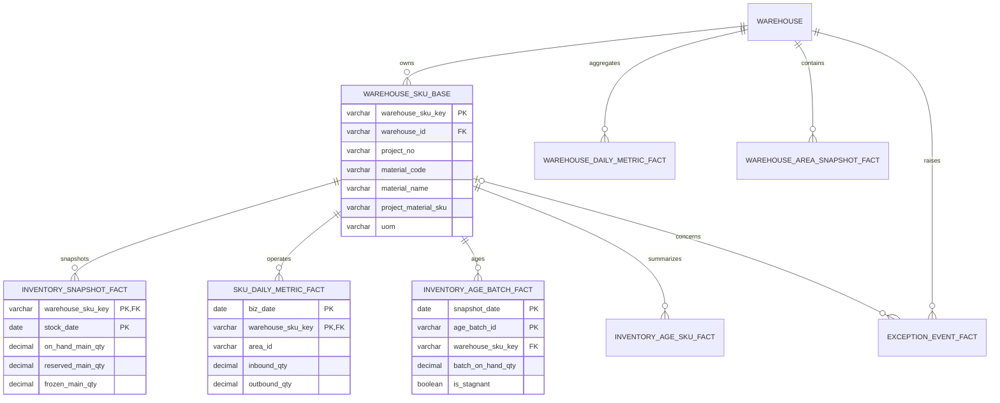

# 仓库运营看板数据库设计

## 1. 数据源与原则

数据源为 `仓库运营信息看板_模拟数据集_2026年7月_库龄呆滞扩展终版.xlsx`。项目使用本机 MySQL 8 和 MyBatis-Plus，不依赖 Docker。

- `warehouse` 保存仓库级主数据。
- `warehouse_sku_base` 是唯一 SKU 基础表，粒度为“仓库 + 项目 + 物料”。
- `*_fact` 只保存业务键、日期和可度量事实，不重复仓库、项目、物料名称。
- 仓库名、物料名、规格等展示字段由 MyBatis XML 联表读取。
- 工作簿中的看板、统计和数据质量页是派生结果，不落库。
- 库存、库区和库龄读取最新快照；日指标按业务日期读取，禁止跨快照求和。

## 2. 核心关系



`warehouse_sku_key` 使用 Excel 中的稳定键，格式为 `warehouse_id|project_no|material_code`。数据库同时对 `(warehouse_id, project_no, material_code)` 建唯一约束。

## 3. 工作表映射

| Excel 工作表 | 落库表 | 粒度 |
|---|---|---|
| 仓库主数据 | `warehouse` | 仓库 |
| 运营_SKU日指标等含 SKU 属性的工作表 | `warehouse_sku_base` | 仓库 + 项目 + 物料，导入时去重合并 |
| 现存量快照 | `inventory_snapshot_fact` | SKU 基础键 + 库存日期 |
| 运营_SKU日指标 | `sku_daily_metric_fact` | 业务日期 + SKU 基础键 |
| 运营_仓库每日指标 | `warehouse_daily_metric_fact` | 业务日期 + 仓库 |
| 运营_库区状态 | `warehouse_area_snapshot_fact` | 快照日期 + 仓库 + 库区 |
| 运营_异常事件 | `exception_event_fact` | 异常编号，可选关联 SKU 基础键 |
| 库龄批次明细 | `inventory_age_batch_fact` | 快照日期 + 批次编号 |
| 库龄SKU汇总 | `inventory_age_sku_fact` | 快照日期 + SKU 基础键 |
| 项目_BOM关系 | `bom_relation` | 项目 + 成品 + 组件 |
| 运营_KPI目标 | `kpi_target` | KPI 名称 |
| 库龄规则 | `inventory_age_rule` | 规则类型 + 规则名称 |

## 4. 本地 MySQL 初始化

```powershell
Start-Service MySQL80
& 'C:\Program Files\MySQL\MySQL Server 8.0\bin\mysql.exe' -u root -p `
  -e "source scripts/init-local-mysql.sql"
cd backend
mvn spring-boot:run
```

默认 JDBC 连接为 `jdbc:mysql://127.0.0.1:3306/warehouse_dashboard`，账号为 `warehouse`。可通过 `WAREHOUSE_DB_URL`、`WAREHOUSE_DB_USERNAME`、`WAREHOUSE_DB_PASSWORD` 覆盖。

Spring Boot 启动时执行 `backend/src/main/resources/schema.sql`。当 `warehouse_sku_base` 为空且种子开关开启时，自动导入终版 Excel。这里特意检查基础表而不是 `warehouse`，使已有旧模型的本地库也能自动初始化新事实表。

旧版表与新版 `*_fact` 表名不同，不会在启动时被破坏。确认新表已完成导入后，可手动执行：

```powershell
& 'C:\Program Files\MySQL\MySQL Server 8.0\bin\mysql.exe' -u warehouse -p warehouse_dashboard `
  -e "source scripts/drop-legacy-tables.sql"
```

## 5. 事务与查询口径

- 完整工作簿先校验 11 张原子数据表，再在单事务中清空和重建业务事实；仓库主数据按主键更新或新增，以兼容仍有外键的旧本地表。
- 基础表先于事实表写入，清理时事实表先于基础表删除，外键始终有效。
- CSV 只按 `业务日期 + 仓库` 合并仓库日指标。
- API 与 Excel 导出通过 MyBatis XML 联表补齐原有展示字段，外部字段结构保持兼容。
- “可用库存”计算为 `现存量 - 预留量 - 冻结量`；库存占比必须使用当前筒库存除以该筒容量，不能使用跨日期合计。
